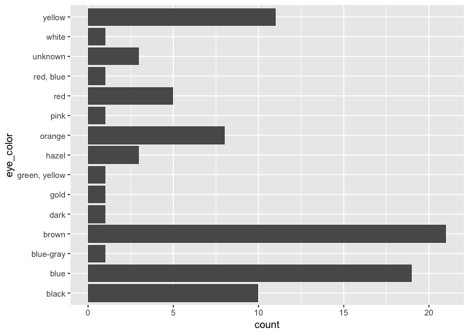
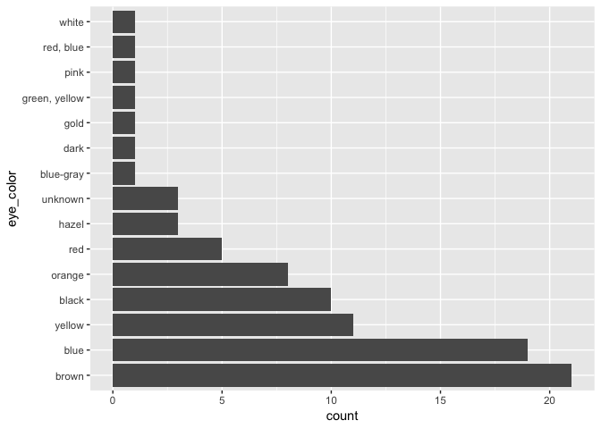

<!-- README.md is generated from README.Rmd. Please edit that file -->
forcats 
=====================================================================

<!-- badges: start -->
[](https://cran.r-project.org/package=forcats) [](https://travis-ci.org/tidyverse/forcats) [](https://codecov.io/gh/tidyverse/forcats?branch=master) <!-- badges: end -->

Overview
--------

R uses **factors** to handle categorical variables, variables that have a fixed and known set of possible values. Factors are also helpful for reordering character vectors to improve display. The goal of the **forcats** package is to provide a suite of tools that solve common problems with factors, including changing the order of levels or the values. Some examples include:

-   `fct_reorder()`: Reordering a factor by another variable.
-   `fct_infreq()`: Reordering a factor by the frequency of values.
-   `fct_relevel()`: Changing the order of a factor by hand.
-   `fct_lump()`: Collapsing the least/most frequent values of a factor into "other".

You can learn more about each of these in vignette("forcats").

Installation
------------

``` r
# The easiest way to get forcats is to install the whole tidyverse:
install.packages("tidyverse")

# Alternatively, install just forcats:
install.packages("forcats")

# Or the the development version from GitHub:
# install.packages("devtools")
devtools::install_github("tidyverse/forcats")
```

Getting started
---------------

forcats is part of the core tidyverse, so you can load it with `library(tidyverse)` or `library(forcats)`.

``` r
library(forcats)
```

``` r
starwars %>% 
  filter(!is.na(species)) %>%
  count(species, sort = TRUE)
#> # A tibble: 37 x 2
#>    species      n
#>    <chr>    <int>
#>  1 Human       35
#>  2 Droid        5
#>  3 Gungan       3
#>  4 Kaminoan     2
#>  5 Mirialan     2
#>  6 Twi'lek      2
#>  7 Wookiee      2
#>  8 Zabrak       2
#>  9 Aleena       1
#> 10 Besalisk     1
#> # … with 27 more rows
```

``` r
starwars %>%
  filter(!is.na(species)) %>%
  mutate(species = fct_lump(species, n = 3)) %>%
  count(species)
#> # A tibble: 4 x 2
#>   species     n
#>   <fct>   <int>
#> 1 Droid       5
#> 2 Gungan      3
#> 3 Human      35
#> 4 Other      39
```

``` r
ggplot(starwars, aes(x = eye_color)) + 
  geom_bar() + 
  coord_flip()
```



``` r
starwars %>%
  mutate(eye_color = fct_infreq(eye_color)) %>%
  ggplot(aes(x = eye_color)) + 
  geom_bar() + 
  coord_flip()
```



Resources
---------

For a history of factors, I recommend [*stringsAsFactors: An unauthorized biography*](http://simplystatistics.org/2015/07/24/stringsasfactors-an-unauthorized-biography/) by Roger Peng, and [*stringsAsFactors = &lt;sigh&gt;*](http://notstatschat.tumblr.com/post/124987394001/stringsasfactors-sigh) by Thomas Lumley. If you want to learn more about other approaches to working with factors and categorical data, I recommend [*Wrangling categorical data in R*](https://peerj.com/preprints/3163/), by Amelia McNamara and Nicholas Horton.) The R for Data Science book also has a [chapter on factors](http://r4ds.had.co.nz/factors.html).

Getting help
------------

If you encounter a clear bug, please file a minimal reproducible example on [github](https://github.com/tidyverse/forcats/issues). For questions and other discussion, please use [community.rstudio.com](https://community.rstudio.com/).

Code of Conduct
---------------

Please note that the 'forcats' project is released with a [Contributor Code of Conduct](.github/CODE_OF_CONDUCT.md). By contributing to this project, you agree to abide by its terms.
